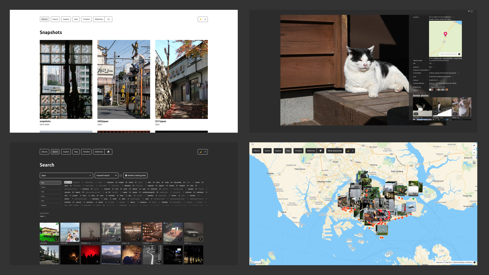

# album



[Live site](https://album-gyng.vercel.app/)

A zero-config, static, file-based album generator.

Photos are dropped into directories, indexed via a Python pipeline (Janus-Pro-1B for AI tags + SigLIP1+2 for embeddings), and served with browser-side SQLite search.

- Dump your photos in a directory and run one command to deploy
- Browser-side keyword, semantic, and hybrid search
- Similar-photo search and slideshow trails powered by SigLIP2 image embeddings
- Janus-Pro-1B metadata extraction for tags, captions, and search text
- Sqlite FTS for keyword search
- Colour palette analysis
- Map mode
- Slideshow, with clock
- Slideshow shuffle, recent-weighted, and similar playback modes
- EXIF support
- YouTube video support
- Local video support (FFmpeg web-optimised transcode)
- Video technical metadata details panel (codec/profile/fps/bitrate/filesize/date)
- Viewport-based local video autoplay/pause
- Next.JS static build, deployed on Vercel
- Custom image optimisation, resizing
- Light and dark modes

Goals

- Minimal friction between camera and publishing on web
- No running infrastructure
- EXIF and GPS data
- Photos are size-optimised for mobile viewing
- Free hosting!

## Usage

You will need Node installed. The following steps are for deployment on Vercel, but you can deploy elsewhere &mdash; this is a standard Next.js application.

0. Clone the repo

   ```
   $ git clone https://github.com/gyng/album.git
   $ cd album/src/public/data/albums
   ```

1. Add your photos/videos in a directory! Each album is a directory in `src/public/data/albums`.

   ```diff
     ├ /albums
   + │ ├─my-album
   + │ │ ├─pic1.jpg
   + │ │ └─cover.pic2.jpg
     │ └─my-album-with-manifest
     │   ├─album.json
     │   └─pic.jpg
     ├ /src
       └─public
         └─data
           └─albums
             └─my-album (optimised images cached here)
   ```

   Optionally, add an `album.json` to the album directory to do album-level configuration.

   Local video files in album directories are auto-detected (`.mp4`, `.mov`, `.m4v`, `.webm`, `.mkv`, `.avi`) and transcoded to web-optimised MP4 during build. On album pages, local videos are auto-played when in viewport and paused when out of viewport.

   ```ts
   {
      // Defaults to oldest-first
      sort?: "newest-first" | "oldest-first",
      // Does a partial match
      cover?: "pic1.jpg",
      externals?: Array<
         {
            type: "youtube",
            href: "https://www.youtube.com/embed/9bw3IL444Uo",
            date?: "2025-11-25"
         } | {
            type: "local",
            href: "clip.mov",
            date?: "2025-11-25"
         }
      >
   }
   ```

   Example

   ```json
   {
     "sort": "newest-first",
     "cover": "pic1.jpg",
     "externals": [
       {
         "type": "youtube",
         "href": "https://www.youtube.com/embed/9bw3IL444Uo",
         "date": "2019-11-07"
       }
     ]
   }
   ```

   Notes for local videos:

   - `date` is optional. If omitted, original capture date is extracted from source metadata when available.
   - The details panel for local videos shows original-file technical metadata (codec, profile, framerate, bitrate, duration, resolution, audio codec, container, filesize).
   - Windows `:Zone.Identifier` sidecar files are deleted/skipped automatically during album scan.

2. Deploy on Vercel (or elsewhere).

   Due to the large size of `public/data/*` (and a long time taken to optimise images/videos), deploys are done manually from your (my?) local machine. Image and video optimisations are cached locally on `next build` or `vercel build` (`.resized_images` / `.resized_videos`). Local videos are transcoded to web-optimised MP4 outputs via FFmpeg and only the optimised output path is used for playback. Outdated cached video sizes are pruned automatically.

   ```
   $ npx vercel@latest login

   # Recommended guided workflow
   $ ./publish-wizard

   # Default mode: ask all decisions up front, then run unattended
   $ ./publish-wizard --fast-track

   # Optional old step-by-step prompts
   $ ./publish-wizard --interactive

   # Dry-run preflight only
   $ ./publish-wizard --dry-run

   # Legacy manual flow
   $ npx vercel@latest build --prod
   $ npx vercel@latest deploy --prebuilt --prod

   # If you hit the file limit
   $ npx vercel@latest deploy --prebuilt --prod --archive=tgz

   # Everything together without prompts
   $ npx vercel@latest pull && npm run index:update && npx vercel@latest build --prod && npx vercel@latest deploy --prebuilt --prod
   ```

   If the build fails, try removing `.vercel` and reinitialising the project. Somehow this seems to happen a lot.

3. Index images by running the script at `/index/index.py` and copying the result to `/src/public`. You need CUDA installed: see [index/README.md](index/README.md). Indexing is incremental, to reset delete `search.sqlite` (or whatever file the DB is in)

   ```sh
   $ cd index
   $ uv sync
   $ uv run python index.py index --glob "../albums/**/*.jpg" --dbpath "search.sqlite" --model-profile hybrid
   $ cp search.sqlite ../src/public/search.sqlite

   # or
   $ ./do-full-index.sh

   # embeddings-only refresh merged into the active public DB
   $ ./do-embeddings-index.sh
   ```

   This can be done from the Next.js app for convenience as well with `npm run index:update`, `npm run index:embeddings:update`, or the guided `npm run publish:wizard`

   The wizard now uses fast-track mode by default: it asks the index/build/deploy questions before the long-running work starts, then continues without further prompts. Use `--interactive` if you want the older step-by-step prompting instead.

   The publish wizard writes a report to `src/.publish-report.json` and currently checks:

   - newly discovered photos versus the current `search.sqlite`
   - missing GPS coordinates on new photos
   - missing EXIF capture timestamps on new photos
   - unreadable EXIF metadata on new photos
   - invalid `album.json`
   - whether all discovered photos are present in the index after indexing

4. To use the manifest creator, run `npm run dev` or `yarn dev` and visit your album's page. Click the `Edit` link at the top.

## Search Modes

The search page now supports three browser-side ranking modes:

- `Keyword search`: FTS5 matches against indexed tags, descriptions, EXIF-derived text, filenames, and geocoded location text.
- `Semantic search`: the browser embeds your query text and ranks photos by cosine similarity against stored image embeddings.
- `Hybrid search`: keyword and semantic rankings are fused with Reciprocal Rank Fusion so strong exact matches and visually related matches can both surface.

The same embeddings table is also used for photo-to-photo similarity on the search page, album detail views, and slideshow similarity trails.

When you switch into semantic or hybrid mode, the site warms the text-embedding model in a web worker and shows a small progress bar while the tokenizer and model load.

When you are browsing a similarity trail on the search page, the source thumbnail also includes a slideshow shortcut that opens `/slideshow?mode=similar&seed=<path>` from the current seed photo.

## How Search Works

There is no search backend. The full search stack runs in the browser:

1. The indexing step writes a SQLite database to `src/public/search.sqlite`.
2. The app downloads that database and opens it with SQLite WASM in the client.
3. Keyword search runs locally with SQLite FTS5 over Janus-generated metadata plus EXIF and geocoded text.
4. Similarity search reads precomputed image embeddings from the `embeddings` table and scores them in the browser.
5. Semantic text search embeds the query in a worker using a SigLIP text model that is compatible with the stored image-embedding space.
6. Hybrid search fuses the keyword and semantic rankings instead of mixing raw BM25 and cosine scores directly.

This keeps deployment simple: the app stays statically hosted, with no search server or vector database to run.

Be sure to configure your license for _all_ images in `src/License.tsx`. By default all photos are licensed under CC BY-NC 4.0.

## Wishlist

- EXIF stripping via filename
- Camera RAW
- Automatic external storage
- Better content-based caching

## Privacy notes

Analytics is integrated into the app at `_app.tsx`. Remove the `<Analytics />` component to remove any analytics. See [Next.js docs on analytics](https://vercel.com/docs/concepts/analytics) for more details.

## Dev notes

Image search is implemented using SQLite in the browser. An [analysis process](index/index.py) creates this database which is dumped into Next.js's `/public` directory.

The following fields are currently indexed

- Janus-Pro 1B tags and description
- SigLIP-compatible image embeddings for semantic, hybrid, and similarity search
- EXIF
- Geocoded locations
- Colour palette

The slideshow supports three playback modes:

- `Random`: default shuffle playback across the available photos.
- `Weighted`: a recent-biased shuffle that prefers newer photos based on EXIF timestamps.
- `Similar`: uses the current image as the seed and advances through visually similar photos.

You can switch modes from the slideshow toolbar or open them directly with `/slideshow?mode=random`, `/slideshow?mode=weighted`, or `/slideshow?mode=similar`.

In slideshow overlays, the map only renders when the current photo has EXIF GPS coordinates. Geocoded location text is still used for display labels, but it is not used as a coordinate fallback for the slideshow map.

Previously a HTTP Range VFS driver was used for Sqlite: however the fallback either didn't work right or a new package version with that feature wasn't released. To make things easier to maintain I switched it back to the official SQLite WASM library.

SQLite in the browser then loads this database and runs local FTS5 queries plus embedding-based ranking. The semantic text model is loaded separately in a worker so the UI can show loading progress without blocking interaction. I'm running SQLite on the main thread so it doesn't need access to shared array buffers. SABs need COOP/COEP headers setup. I ran things on the main thread to remove any need for COOP/COEP header hackery (on Vercel, very difficult to debug headers!). This does mean the full database (multi-megabyte) is loaded which can take some time.

<details>
<summary>Details on hack needed to get COOP/COEP headers working back when the range VFS was used:</summary>
Vercel is unable to serve the library's JS files from Next.js's `_next/` build directory with these headers, even with configuration set up in next.config.js and vercel.json. Middleware and API functions cannot redirect or add headers to these files either.

A service worker modified from [coi-serviceworker](https://github.com/gzuidhof/coi-serviceworker) is used to add headers instead. This works, but has an unfortunate downside of requiring a page reload after initial install.

</details>

---

To update the README screenshot:

```sh
cd src
npm run screenshot
```

This captures `screenshot.html` at a fixed 3840×2160 viewport (iframes load from production) and writes `screenshot.jpg` to the repo root.
