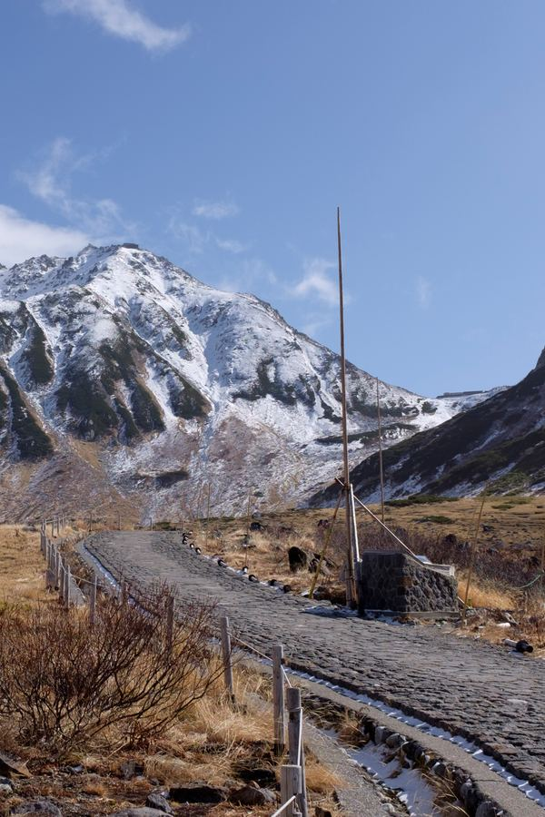
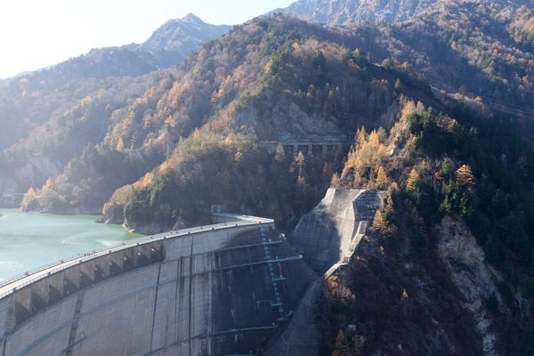
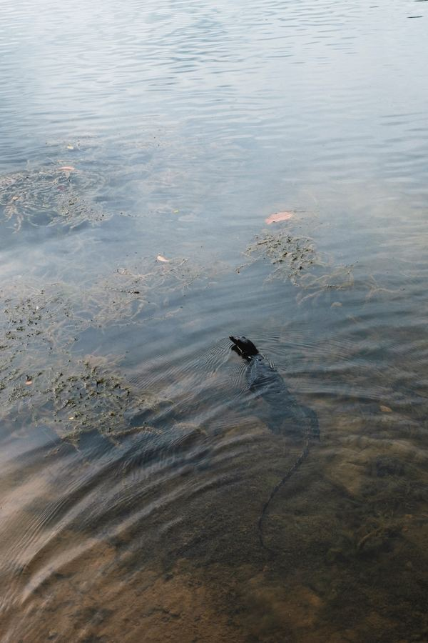
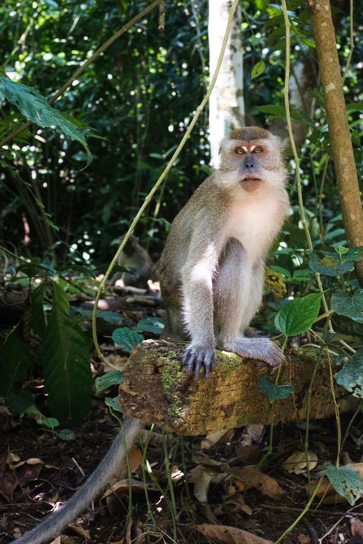
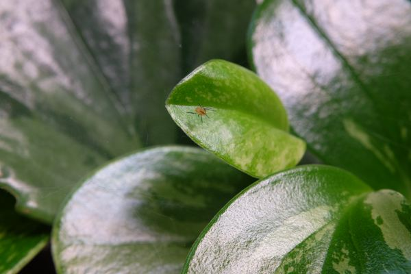

# Caption backend bake-off — 17–18 July 2026

> **Status: shipped.** Default swapped from Janus-Pro-1B to Gemma 4 E4B `UD-Q4_K_XL` on a
> resident `llama-server`, tags reshaped for facets, visible-text capture added, and the full
> library reindexed and published on 18 Jul. See *Decision and outcome* below for the result and
> the one bug the pipeline caught before publish.
>
> **Update, 3 August 2026:** the Janus backend was removed outright. It had been
> kept as a rollback, but the library was re-captioned with Gemma in July and the
> measurements below are why nobody would go back. Commands and flags named after
> it in this document no longer exist; they are preserved as a record of what was
> run at the time.

Twelve models captioning the same eleven photos. Five run locally on a 10GB RTX 3080;
seven are remote (Anthropic and OpenAI) and are **marked cloud throughout** — they are not a
like-for-like operational option and their numbers are not comparable on speed or memory
(see Caveats).

This document records the **findings**. The result sets it is derived from
(`index/.local-quality-*.json`, `index/.cloud-quality-raw.json`) and the fixture
(`index/.caption-quality-fixture-local.json`) are gitignored and regenerable — see
Reproducing. Nothing here depends on those files still existing.

## The headline

**The benchmark was structurally blind to its incumbent's biggest flaw.**
`evaluate_caption_quality_cases` searches `tags` and `alt_text` *joined*, so Janus scores
10/11 on the strength of its sentence while its tags are bare words lifted out of that same
sentence — `depicts`, `under`, `image`. Only ~6% of Janus tags are the multi-word phrases
the prompt demands, against ~90% for every other local model. Scored on tags alone it drops
to 7/11. `evaluate_tag_quality` was added to measure this; tags are what the FTS index
stores, so that is the number that matters.

## Results

| | model | tags+alt | tags only | tags/img | junk% | phrase% | s/img | peak VRAM | $/1k | all 1,495 |
|---|---|---|---|---|---|---|---|---|---|---|
| local | Janus-Pro-1B | 10/11 | **7/11** | 5.0 | 11% | 6% | 1.31 | 5.4 GB | free | free |
| local | Gemma 4 E4B · Q8_0 | 8/11 | **9/11** | 9.5 | 0% | 90% | 1.85 | 8.0 GB | free | free |
| local | Gemma 4 E4B · UD-Q5_K_XL | 9/11 | **9/11** | 10.0 | 0% | 89% | 1.59 | 7.2 GB | free | free |
| local | Gemma 4 E4B · UD-Q4_K_XL | 8/11 | **9/11** | 8.6 | 0% | 90% | 1.55 | 6.2 GB | free | free |
| local | Qwen3-VL-8B · UD-Q5_K_XL | 9/11 | **9/11** | 9.4 | 0% | 92% | 9.08 | 9.1 GB | free | free |
| **cloud** | Claude Haiku 4.5 | 10/11 | **10/11** | 5.0 | 0% | 67% | — | — | $1.92 | $2.87 |
| **cloud** | GPT-5.6 Luna | 10/11 | **10/11** | 7.3 | 0% | 94% | — | — | $2.30 | $3.44 |
| **cloud** | Claude Sonnet 5 | 11/11 | **11/11** | 10.0 | 0% | 98% | — | — | $4.22 | $6.31 |
| **cloud** | GPT-5.6 Terra | 9/11 | **9/11** | 7.1 | 0% | 92% | — | — | $5.67 | $8.48 |
| **cloud** | Claude Opus 4.8 | 11/11 | **11/11** | 10.0 | 0% | 99% | — | — | $10.85 | $16.22 |
| **cloud** | GPT-5.6 Sol | 10/11 | **10/11** | 6.2 | 0% | 94% | — | — | $11.25 | $16.82 |
| **cloud** | Claude Fable 5 | 11/11 | **11/11** | 9.2 | 0% | 91% | — | — | $20.96 | $31.34 |

s/img is **steady-state on the resident `llama-server`** (re-measured 18 Jul after the port):
mean of images 2-11 per model, excluding the one-time load, which amortises to nothing over a
real 1,480-photo batch. The earlier subprocess-per-image numbers were 3-3.5x higher for the
Gemma quants (5.2-5.7s) because each photo paid a fresh model load; Janus (1.31s, batches four)
and Qwen (9.08s, big model, inference-bound) barely moved. VRAM is peak above a 688 MiB idle
baseline.

## The fixture photographs

The five fixture frames and the sentence each model wrote for them — the evidence behind
the scores above. These are the `test-simple` cases, which ship with the repository; the
other six frames come from unpublished albums, so only their aggregate scores appear in
*Results*.

### snowy landscape — `DSCF0506-2.jpg`



Passes on any of `mountain`, `snow`, `peak`; fails on `beach`, `ocean`.

| | model | wrote | |
|---|---|---|---|
| local | Janus-Pro-1B | A scenic mountain path with snow-covered peaks and a clear blue sky. | ✓ |
| local | Gemma 4 E4B · Q8_0 | A solitary hiking trail winds through rocky, snowy mountains under a clear blue sky. | ✓ |
| local | Gemma 4 E4B · UD-Q5_K_XL | A winding dirt road traverses a remote, snowy mountain pass under a clear blue sky, showing sparse alpine vegetation. | ✓ |
| local | Gemma 4 E4B · UD-Q4_K_XL | A dirt road winds through an alpine landscape beneath snow-covered mountains under a bright blue sky. | ✓ |
| local | Qwen3-VL-8B · UD-Q5_K_XL | A snowy mountain road with stone pathway, wooden fence, and clear blue sky in a winter landscape. | ✓ |
| cloud | Claude Haiku 4.5 | Snow-covered mountain with wooden fence and poles near geothermal steam area. | ✓ |
| cloud | GPT-5.6 Luna | A stone path leads towards a rugged, snow-covered mountain beneath a broad blue sky with wispy clouds. | ✓ |
| cloud | Claude Sonnet 5 | A paved stone path lined with a wooden rope fence leads toward a snow-streaked mountain peak under a clear blue sky. | ✓ |
| cloud | GPT-5.6 Terra | A stone path curves through dry alpine grass towards a rugged, snow-covered mountain beneath a clear blue sky. | ✓ |
| cloud | Claude Opus 4.8 | A cobbled path lined with wooden fence posts and tall bamboo poles curves through dry golden grassland towards a snow-covered mountain ridge under a clear blue sky. | ✓ |
| cloud | GPT-5.6 Sol | A stone path curves towards a rugged, snow-covered mountain beneath a clear blue sky. | ✓ |
| cloud | Claude Fable 5 | A cobblestone trail lined with rope fencing and bamboo poles crosses dry alpine grassland towards a snow-dusted mountain under a clear blue sky. | ✓ |

### infrastructure — `DSCF0593.jpg`



Passes on any of `dam`, `reservoir`; fails on `skyscraper`, `airport`.

| | model | wrote | |
|---|---|---|---|
| local | Janus-Pro-1B | A large dam stands majestically in a forested mountain range, with a bridge crossing over it. | ✓ |
| local | Gemma 4 E4B · Q8_0 | A large dam structure is visible at the base of a steep, densely forested mountain hillside overlooking the reservoir. | ✓ |
| local | Gemma 4 E4B · UD-Q5_K_XL | A massive concrete dam spans a river gorge, with dense, autumnal forests covering the steep mountain slopes behind it. | ✓ |
| local | Gemma 4 E4B · UD-Q4_K_XL | A large hydroelectric dam is visible, stretching across the foreground with dense, forested mountains and a reservoir in the background. | ✓ |
| local | Qwen3-VL-8B · UD-Q5_K_XL | A large concrete dam spans a reservoir, surrounded by autumn-colored forests and steep mountain slopes under bright sunlight. | ✓ |
| cloud | Claude Haiku 4.5 | Large concrete dam spanning a mountain valley surrounded by autumn forest. | ✓ |
| cloud | GPT-5.6 Luna | A massive concrete dam spans a turquoise reservoir below forested mountains dotted with autumn foliage. | ✓ |
| cloud | Claude Sonnet 5 | A large curved concrete dam holds back a turquoise reservoir in a steep mountain valley covered with autumn-coloured trees. | ✓ |
| cloud | GPT-5.6 Terra | A large concrete dam spans a turquoise reservoir below forested mountains covered in autumn foliage. | ✓ |
| cloud | Claude Opus 4.8 | An elevated view of a curved concrete dam holding back a turquoise reservoir, with a walkway along its crest and autumn-coloured forested mountains rising on either side. | ✓ |
| cloud | GPT-5.6 Sol | A large concrete dam spans a turquoise reservoir below forested mountains dotted with autumn foliage. | ✓ |
| cloud | Claude Fable 5 | A large curved concrete arch dam holds back a turquoise reservoir among steep forested mountains with golden autumn larches. | ✓ |

### water wildlife — `DSCF2485-2.jpg`



Passes on any of `lizard`, `monitor`, `varanus`, `reptile`; fails on `otter`, `turtle`, `duck`, `snake`, `alligator`, `crocodile`.

| | model | wrote | |
|---|---|---|---|
| local | Janus-Pro-1B | A small duck swims in a calm waterfall surrounded by clear water and ripples. | ✗ |
| local | Gemma 4 E4B · Q8_0 | A dark-colored fish is submerged near a fishing lure in clear, shallow water during the daytime. | ✗ |
| local | Gemma 4 E4B · UD-Q5_K_XL | A dark fish is visible under the calm, clear water of a pond, with ripples spreading from the spot. | ✗ |
| local | Gemma 4 E4B · UD-Q4_K_XL | A dark fish swims beneath the surface of calm, shallow bay water covered in algae and reflecting the sky. | ✗ |
| local | Qwen3-VL-8B · UD-Q5_K_XL | An alligator swims in shallow water with algae patches and ripples visible on the surface. | ✗ |
| cloud | Claude Haiku 4.5 | Seal swimming in shallow coastal water with rocky seabed and seaweed. | ✗ |
| cloud | GPT-5.6 Luna | A dark turtle swims through shallow pond water, leaving ripples behind its partially submerged shell among floating leaves and aquatic vegetation. | ✗ |
| cloud | Claude Sonnet 5 | A reptile with a long tail swims just below the surface of shallow, plant-strewn water, its head poking above the ripples. | ✓ |
| cloud | GPT-5.6 Terra | A turtle swims through shallow pond water, leaving ripples among submerged plants and scattered floating leaves. | ✗ |
| cloud | Claude Opus 4.8 | A monitor lizard swims just below the surface of shallow murky water, its head raised above the ripples and long tail trailing behind over a sandy, algae-strewn bottom. | ✓ |
| cloud | GPT-5.6 Sol | A dark turtle swims through shallow pond water, leaving ripples among submerged plants and scattered leaves. | ✗ |
| cloud | Claude Fable 5 | A dark monitor lizard swims through calm shallow water, its long tail trailing behind and ripples spreading around patches of aquatic weed. | ✓ |

### wildlife portrait — `DSCF2581-2_2.jpg`



Passes on any of `macaque`, `monkey`, `primate`; fails on `dog`, `cat`, `baboon`, `african`.

| | model | wrote | |
|---|---|---|---|
| local | Janus-Pro-1B | A monkey sits on a tree branch surrounded by lush green foliage. | ✓ |
| local | Gemma 4 E4B · Q8_0 | A baboon monkey is perched on a mossy tree branch, looking directly at the camera in a dense forest environment. | ✗ |
| local | Gemma 4 E4B · UD-Q5_K_XL | A baboon sits on a mossy log in a dense, green forest environment, looking directly at the viewer. | ✗ |
| local | Gemma 4 E4B · UD-Q4_K_XL | A small baboon primate sits on a moss-covered branch in a dense, humid tropical forest. | ✗ |
| local | Qwen3-VL-8B · UD-Q5_K_XL | A monkey sits on a mossy rock in a dense forest, surrounded by green foliage and dappled sunlight. | ✓ |
| cloud | Claude Haiku 4.5 | Primate sitting on moss-covered rock within dense tropical jungle environment. | ✓ |
| cloud | GPT-5.6 Luna | A long-tailed macaque sits on a mossy branch and looks towards the camera amid dense green tropical foliage. | ✓ |
| cloud | Claude Sonnet 5 | A long-tailed macaque sits alert on a fallen log amid dense green jungle foliage and hanging vines, staring at the camera. | ✓ |
| cloud | GPT-5.6 Terra | A macaque sits alert on a low tree branch amid dense green tropical forest foliage. | ✓ |
| cloud | Claude Opus 4.8 | A long-tailed macaque sits upright on a mossy log in dense green rainforest, looking towards the camera while a second monkey is visible blurred in the background. | ✓ |
| cloud | GPT-5.6 Sol | A macaque sits alert on a fallen log amid dense green foliage in a sun-dappled tropical forest. | ✓ |
| cloud | Claude Fable 5 | A long-tailed macaque sits upright on a mossy fallen log in dense tropical forest, staring ahead while another monkey forages in the background. | ✓ |

### macro wildlife — `DSCF2768.JPG`



Passes on any of `spider`, `arachnid`, `insect`; fails on `bird`, `fish`.

| | model | wrote | |
|---|---|---|---|
| local | Janus-Pro-1B | A close-up of a green leafy plant with a small insect on one of its leaves. | ✓ |
| local | Gemma 4 E4B · Q8_0 | A tiny leafhopper insect rests on a vibrant, glossy green leaf surrounded by lush, textured foliage. | ✓ |
| local | Gemma 4 E4B · UD-Q5_K_XL | A tiny red spider rests on a glossy, bright green leaf surrounded by large, variegated foliage. | ✓ |
| local | Gemma 4 E4B · UD-Q4_K_XL | A tiny insect rests on the bright green, textured surface of a mint leaf in a lush garden setting. | ✓ |
| local | Qwen3-VL-8B · UD-Q5_K_XL | A small spider rests on a glossy green leaf among other leaves in a close-up nature photo. | ✓ |
| cloud | Claude Haiku 4.5 | Small reddish-brown insect perched on green plant seedpod in nature. | ✓ |
| cloud | GPT-5.6 Luna | A tiny orange spider stands on a glossy green leaf beside faint strands of web in a softly blurred setting. | ✓ |
| cloud | Claude Sonnet 5 | A tiny orange spider with long legs perches on a variegated green leaf in an extreme macro close-up. | ✓ |
| cloud | GPT-5.6 Terra | A tiny orange spider stands on a glossy green leaf surrounded by faint strands of web. | ✓ |
| cloud | Claude Opus 4.8 | A tiny orange spider rests on the curled edge of a variegated green and silver leaf, with fine web strands crossing the surrounding foliage in this macro close-up. | ✓ |
| cloud | GPT-5.6 Sol | A tiny orange spider rests on a glossy green leaf beside faint strands of web. | ✓ |
| cloud | Claude Fable 5 | A tiny orange spider with long thin legs sits on the edge of a glossy green succulent leaf in a close-up shot. | ✓ |

## Findings

### 1. Quantisation is quality-neutral; the Q8_0 default buys nothing

`Q8_0`, `UD-Q5_K_XL` and `UD-Q4_K_XL` score identically with identical failures. `UD-Q4_K_XL`
gives the same captions for **3 GB less VRAM**. Real free VRAM is ~9.07 GB (WSL2 overhead on
a 10240 MiB card), so `Q8_0` (8.19 GB) + `mmproj-BF16` (0.99 GB) = 9.18 GB genuinely cannot
fit and spills via `--gpu-layers auto`.

The docs' 9.9–10.4 s/image figure for `Q8_0` is stale; on the resident server it measures
1.85 s steady-state (5.70 s under the old subprocess-per-image path).

### 2. The GGUF speed gap is architecture, not the model — and ~70% of it is recoverable

`Gemma4GgufClassifier` spawns one `llama-mtmd-cli` subprocess **per image**, reloading 5–8 GB
of weights every time. Janus loads once (8 s) and batches four images per forward pass. The
~75 ms "init" the GGUF backends report is not a model load at all — it is `shutil.which()`
finding the binary. The real load happens inside every `predict()`.

Measured directly on `UD-Q4_K_XL`, one image, from llama.cpp's own log:

| | wall | where it goes |
|---|---|---|
| cold | 5.15 s | |
| warm (page cache) | 4.11 s | model load completes ~2.44 s in; image encode done at 2.87 s; generation ≈1.2 s |

**About 70% of per-image wall-clock is process startup and weight loading; only ~1.2 s is
inference.** Across the 1,495-photo library that is ~1,495 redundant model loads.

Running `llama-server` once and posting per image should therefore land Gemma `UD-Q4_K_XL`
near **Janus's speed** — while keeping its 9/11 tags, 91% phrase rate and 0% junk. If that holds
it removes the only real argument for keeping Janus, whose deficit is tag *shape*. (It did: see
the measured result below.)

**Ported, and re-measured steady-state (18 Jul).** `Gemma4GgufClassifier` now starts one
`llama-server`, health-checks it, POSTs per image and tears it down on release. Steady-state
per image (mean of fixture images 2-11, one-time load excluded — it amortises to nothing over a
real batch):

| path | pass | s/img |
|---|---|---|
| Gemma `UD-Q4_K_XL`, subprocess per image (was) | 9/11 | 5.40 |
| **Gemma `UD-Q4_K_XL`, persistent server (now)** | **9/11** | **1.55** |
| Janus-Pro-1B (batches four) | 10/11 | 1.31 |

**~3.5x faster with no quality change.** (An earlier draft reported 2.09 s for the server path;
that was the full-fixture average *including* the one-time model load — a fixture artefact that
overstates the per-photo cost at scale. The steady-state 1.55 s is the honest number for a
1,480-photo run.)

That does not make Gemma faster than Janus — Janus, batching four images per pass, is 1.31 s to
Gemma's 1.55 s, ~18% quicker. But that is a different argument from 3x. Against 0.24 s/image,
Gemma `UD-Q4_K_XL` carries 9/11 concept-in-tags to Janus's 7/11, 91% concrete phrases to 6%,
and 0% junk to 11%, in 6.2 GB. The right call for a search index; on the library, a few extra
minutes on a one-off reindex.

The win is proportional to how much of per-image time *was* model load: the small Gemma (fast
inference, load-dominated) gains 3.5x, while the much larger Qwen3-VL-8B (inference-bound at
~9 s) barely moved on the server (9.55 -> 9.08 s).

**One non-obvious gotcha, worth its own note.** Naively posting to `/v1/chat/completions`
returns an **empty `content`**: Gemma 4's chat template puts the server in thinking mode, the
whole token budget is spent in `reasoning_content`, and the reply stops at
`finish_reason: "length"` having said nothing. `response_format: json_schema` does not prevent
it and a request-level `reasoning_budget: 0` is ignored. The switch is
`chat_template_kwargs: {"enable_thinking": false}`, which is also most of the speed win. The
subprocess path never hit this because `--json-schema-file` constrained output from the first
token. There is a regression test for it.

### 3. Inter-model disagreement is a usable confidence signal

Pooling tags per frame and separating consensus (≥4/5 local models) from singletons (exactly
one model):

- **Every non-animal frame has a solid consensus core** — `dam, reservoir, water`;
  `coffee, door, menu`; `bowl, chopsticks, ramen`.
- **Frame 3 has no consensus about the subject at all.** The only words ≥4 models share are
  `shallow` and `water`. Nothing about the animal.
- **Frame 5 has no consensus on `spider`** either.

Both agreement collapses are on frames where the models are in fact wrong. When the models
cannot agree on the subject, none of them know it. **This is the cheapest available triage
signal for which fixture cases need human re-review** — no ground truth required.

### 4. Singletons separate the models by kind, not just quality

- **Qwen's** uniques are *verifiable detail nobody else saw*: `fence`, `gravel`, `wooden`
  (frame 1); `tail`, `fur`, `long` (frame 4 — the tail is the diagnostic macaque feature);
  `bin`, `bucket`, `leaning` (frame 7); `perforated` (frame 11).
- **Gemma's** uniques skew *abstract and invented*: `wilderness`, `travel`, `family`, `cozy`,
  `abstract`, `moment`. On frame 3, `Q8_0` and `UD-Q5` hallucinated an entire fishing trip —
  `hunting`, `lure`, `submerged` / `angler's`, `tackle`.
- **Janus** contributes almost no singletons. It is too terse to add anything.

Ranking by tag usefulness is Qwen > Gemma > Janus — the exact inverse of the speed ranking.

### 5. Frame 3 is the discriminator, and only three models pass it

`test-simple/DSCF2485-2.jpg` is a **water monitor lizard** (photographer-confirmed).

| | model | said | |
|---|---|---|---|
| local | Janus-Pro-1B | "a small duck" | ✗ |
| local | Gemma `Q8_0` | "snake in water" | ✗ |
| local | Gemma `UD-Q5` | "otter" (+ an invented angler with tackle) | ✗ |
| local | Gemma `UD-Q4` | "snapping turtle" | ✗ |
| local | Qwen3-VL-8B | "alligator" | ✗ |
| cloud | Claude Haiku 4.5 | "seal", "coastal water", "rocky seabed" | ✗ |
| cloud | GPT-5.6 Luna | "swimming turtle" | ✗ |
| cloud | GPT-5.6 Terra | "swimming turtle" | ✗ |
| cloud | GPT-5.6 Sol | "swimming turtle" | ✗ |
| cloud | Claude Sonnet 5 | "swimming reptile", "long tail" | ✓ class |
| cloud | Claude Opus 4.8 | "swimming monitor lizard" | ✓ species |
| cloud | Claude Fable 5 | "monitor lizard" | ✓ species |

Nine of twelve fail, in seven different directions. **All three GPT-5.6 models say "turtle" —
the exact answer the retired fixture rewarded**, which is independent confirmation that the old
label was certifying the wrong answer rather than testing for the right one.

### 6. General captioning is saturated — only fine-grained ID discriminates

On 8 of 11 frames there is no local/cloud gap at all. Every model on both sides reads the
hand-painted sign ("coffee, tea, toast, fries, gelato"), so OCR is not the local weakness one
might expect. The gap is two frames, both species ID (the lizard and the macaque, where every
Gemma says "baboon").

Cloud is not uniformly better, either: **Haiku invented a geothermal field** — steam vents,
volcanic terrain — on the snowy landscape, where all five local models were duller and
entirely honest; and the sole fail on the signage frame is **GPT-5.6 Terra**, which reads the
sign and then omits it from its tags. "Cloud is better" reduces to "cloud is better at naming
species, and occasionally hallucinates scenery".

### 7. Two ground-truth errors were found in the fixture — one of them mine

- **Frame 3 was labelled `turtle / duck / waterfowl`.** Janus captions it "a small duck". The
  label was almost certainly written *from Janus's output* rather than from the photo, making
  the case circular: it could never fail the incumbent, and would have failed a model that
  correctly said "reptile". `UD-Q4` scored 5/5 on the old fixture by hallucinating
  "snapping turtle" — the *worse* answer scoring higher.
- **Frame 8 was labelled `lantern` by me, after looking at the photo.** Fable 5 and Sonnet 5
  read the hanging objects as glass furin wind chimes; a zoom confirmed furin. I then
  over-corrected the label to wind-chimes-only — also wrong: the photographer confirms the
  frame has **both** lanterns and wind chimes. A crop is not evidence about a whole frame.

The lesson is not "the author was careless". Single-reviewer ground truth is unreliable on
unfamiliar subject matter, and a benchmark that encodes a model's own error as truth is worse
than no benchmark — it actively certifies the failure. Cross-model disagreement (finding 3)
is what flagged both cases.

### 8. Tags must be facet-shaped, not caption-shaped

The caption `tags` do double duty: they populate the click-to-filter facet panel
(`image_tags` -> `tags` table, exact-string `COUNT(DISTINCT path)`) and they are a
searched FTS column. The original prompt asked for "concrete one-to-four-word
phrases" and "useful visual themes", which produced good *descriptions* and useless
*facets*. Measured on 17 real album photos:

| prompt | tags/photo | words/tag | unique tags | shared across photos |
|---|---|---|---|---|
| original ("phrases + themes") | 9.9 | 1.89 | 168 of 168 | 1 |
| facet-tuned (short nouns) | 6.0 | 1.04 | 81 of 102 | 13 |

The original produced **~100% unique tags** — projected to the 863-photo library
that is ~8,500 facet entries all at count 1, a filter panel with no usable head.
The facet-tuned prompt builds a real head (`building`, `temple`, `autumn`, `panda`,
...) because it emits short reusable nouns. Nothing is lost for search: `alt_text`
is also an FTS column, so the descriptive richness that used to be crammed into tag
phrases still gets indexed there.

A tightening pass (prefer the specific word, name and forbid catch-alls) cut vague
tags from 14% to 6%. The residue — a few catch-alls and synonym clusters
(`railroad`/`train`/`railway`) — resists further prompting and is better handled by
a deterministic post-filter at the facet-display layer, which keeps those tags
searchable while hiding them from the panel and can be tuned without re-captioning.

### 9. Caption backend is orthogonal to semantic search

`embedding_pipeline_version` keys only off the SigLIP model id and revision and never reads
the caption backend; `BaseCaptionClassifier` and `BaseImageEmbedder` are separate hierarchies
with separate stages. **Swapping the captioner never invalidates embeddings or touches
semantic search.** Changing the captioner requires no re-embed.

### 10. Junk tags are a latent bug, not a live one

Janus + its prompt emitted 11% literal junk tags (`depicts`, `under`, `image`). At the time the
live DB was clean only because it predated that prompt and the `tags` facet table was
geocode-only — a Janus reindex would have pushed junk into the FTS `images.tags` column.
**Resolved by the swap:** Gemma `UD-Q4_K_XL` emits 0% junk, and the 18 Jul reindex verified a
clean facet table. Had we reindexed on Janus instead, this would have shipped the junk live.

## Decision and outcome (18 Jul)

**Swapped the default to Gemma 4 E4B `UD-Q4_K_XL`, and reindexed the whole library.** The
original recommendation was "keep Janus, its deficit is tag *shape*, try to fix that first" —
so that is what happened, and the fix changed the answer:

1. **The per-image subprocess reload was the whole speed gap.** Porting `Gemma4GgufClassifier`
   to one resident `llama-server` took it from 5.40 to **1.55 s/image** steady-state (finding 2).
   That is ~18% slower than Janus (1.31 s, which batches four), not 3×.
2. **Tags were reshaped for facets** (finding 8): short lowercase nouns, subject first, catch-alls
   named and discouraged. Janus's tag deficit is structural (bare words from its own sentence);
   Gemma's tags are clean facet vocabulary.
3. Trading 0.4 s/image for 9/11 concept-in-tags vs 7/11, 91% phrases vs 6%, and 0% junk vs 11%
   is the right call for a search index. On the library that is ~10 extra minutes on a one-off
   reindex.

**Shipped in production**, verified against the published `search.sqlite`:

- 1,480 photos re-captioned; the facet `tags` table now has a real head — `sky` (166),
  `trees` (158), `building` (153), `night` (136), `mountain` (117) — where it was geocode-only
  before. 2,047 unique facets, versus the ~8,500 the descriptive prompt would have produced.
- **Visible-text capture** (an explicit prompt clause): 275 photos now quote their signage in
  `alt_text` and are findable by it — `gelato`, `TOSHIBA`, `メニュー`, `第45雪映氷まつり`. CJK is
  searchable for 3+ character queries; 2-char queries miss on the porter-trigram ≥3-char floor,
  a pre-existing tokenizer trait, not a capture gap (146 photos carry CJK text).
- `search.sqlite` grew 5.0 → 6.1 MB; the embeddings DB stayed 3.3 MB (embeddings reused — the
  caption swap does not touch them, finding 9).

**One bug the pipeline caught, worth recording.** The swap changed the default backend in the
`index` command and in `validate_index_database`, but missed the `validate` CLI command's own
`--classifier-backend` default (still `janus`). `validate` recomputes the expected caption
pipeline version from that backend, so it compared janus-versioned expectations against
correctly gemma-versioned captions and **rejected every row, aborting `do-full-index` before
publish**. The data was correct; the check was stale. Fixed, with a regression test asserting
the two CLI defaults stay equal. The guard doing its job is why a mismatched DB never shipped.

**BM25 column weighting was investigated and rejected as not-warranted.** The hypothesis was
that a `tags` match should outrank the same term in a long `alt_text` sentence. Measured on the
real DB: unweighted BM25 already puts 20/20 tag-matches in the top 20 for `building` and `city`,
because BM25 length-normalises and `tags` is a short field. Filename (camera-code) collisions do
not occur (0 filename-only matches across six content queries), and place search already works
unweighted (`paris` → Paris). Explicit weights only reshuffle equally-valid tag-matches and risk
regressing place search by demoting `geocode`. No change shipped.

**SigLIP v1/v2 left as-is** (separate analysis). The DB stores both image-embedding sets; text
search is v1 end to end, "more like this" uses v2 for free (both sides pre-computed, no client
encoder). v2 text search stays blocked by the client text-encoder weight — ~350 MB, because
SigLIP2's Gemma tokenizer is a 256k vocab (8× v1), 70% of the model. Gemma 4 does not change
this: it runs server-side and is a generative decoder, not a retrieval dual-encoder. The reindex
made keyword search strong enough that the v2 text upgrade matters even less than before.

**Do not adopt Qwen3-VL-8B blind**: it peaks at 9981 of 10240 MiB (97% of the card) and would
OOM under the hybrid profile, which already loads three models.

**Cost is not the argument against cloud, and an earlier draft of this doc was wrong to imply
it was.** At 1,495 photos in the library, a full re-caption costs $2.87 (Haiku 4.5), $3.44
(GPT-5.6 Luna), $6.31 (Sonnet 5), $16.22 (Opus 4.8) or $31.34 (Fable 5) — one-off, with
incremental indexing in the cents. GPT-5.6 Luna scores 10/11 on tags for $3.44; Sonnet 5
scores 11/11 for $6.31. Both beat every local model.

The real arguments for staying local are that this is a **personal photo library** — captioning
it in the cloud means sending every private photo to a third-party API — and that the indexer
is an offline pipeline with no network dependency today. Those are the tradeoffs to weigh.
Cost is not one of them.

## Caveats — read before trusting any number here

- **Eleven frames.** Thin. Treat single-case differences as anecdote.
- **The cloud models were run through the Claude Code agent harness, not the Messages API**
  (no `ANTHROPIC_API_KEY` on this machine). Same models, same prompt, same photos — but
  wrapped in an agent with its own system prompt and tools. **Caption content is comparable;
  latency, memory and cost are not**, which is why those columns are blank. Re-run via the
  API for defensible operational numbers.
- **`parseSuccess` is not comparable across local backends.** The GGUF path gets
  `--json-schema-file` (llama.cpp grammar — malformed output is impossible); Janus gets a
  softer `JsonCompletionLogitsProcessor`; the Gemma 4 HF path constrains nothing at all. That
  metric measures the harness wiring, not the model.
- **Fable 5 was run without server-side `fallbacks`, deliberately.** A fallback would serve
  Opus's answer under Fable's name on a refusal and silently corrupt the comparison.
- **Six of eleven frames were reviewed by opening the image; the fixture ground truth is
  single-reviewer** and, as finding 7 shows, has been wrong twice.

## Reproducing

The fixture and result sets are gitignored (real albums are not in git). To regenerate:

```sh
cd index
# local models — needs llama.cpp at ~/.local/opt (never /tmp; a reboot wipes it)
uv run python index.py benchmark-caption-quality --backend janus \
  --fixture .caption-quality-fixture-local.json --output .local-quality-janus.json

G=~/.local/share/gguf/gemma-4-E4B-it
uv run python index.py benchmark-caption-quality --backend gemma4-gguf \
  --model-id "$G/gemma-4-E4B-it-UD-Q4_K_XL.gguf" --quantization "$G/mmproj-BF16.gguf" \
  --fixture .caption-quality-fixture-local.json --output .local-quality-gemma-UD-Q4_K_XL.json
```

For `gemma4-gguf`, pick the quant via the `--model-id` repo tag
(`unsloth/gemma-4-E4B-it-GGUF:UD-Q5_K_XL`) or point `--model-id` at a local `.gguf` and pass
the mmproj path as `--quantization`. See `index/README.md` for the llama.cpp build and the
`$LLAMA_MTMD_CLI` resolution order.

The committed fixture (`index/caption-quality-benchmark.json`) covers the five `test-simple`
frames only, since `albums/test-*` is the only album data in git.

A rendered view of these results is served at `/benchmark`
(`src/screens/benchmark/`), generated from `captionBenchmark.json`.
