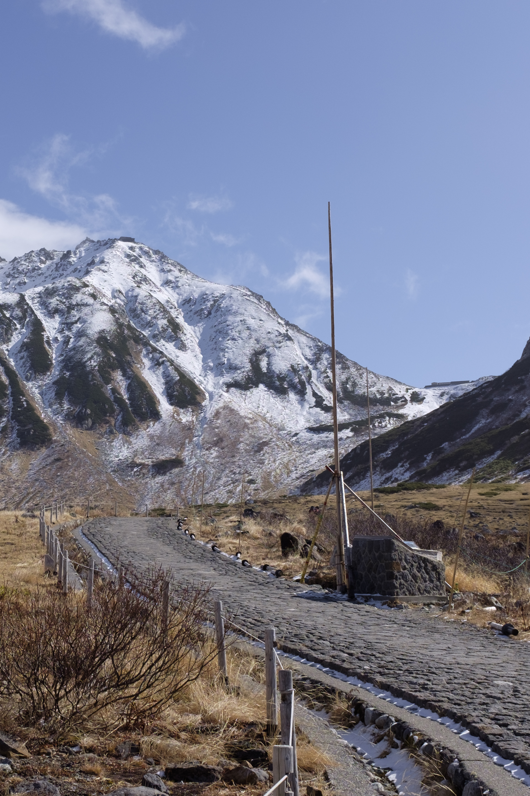
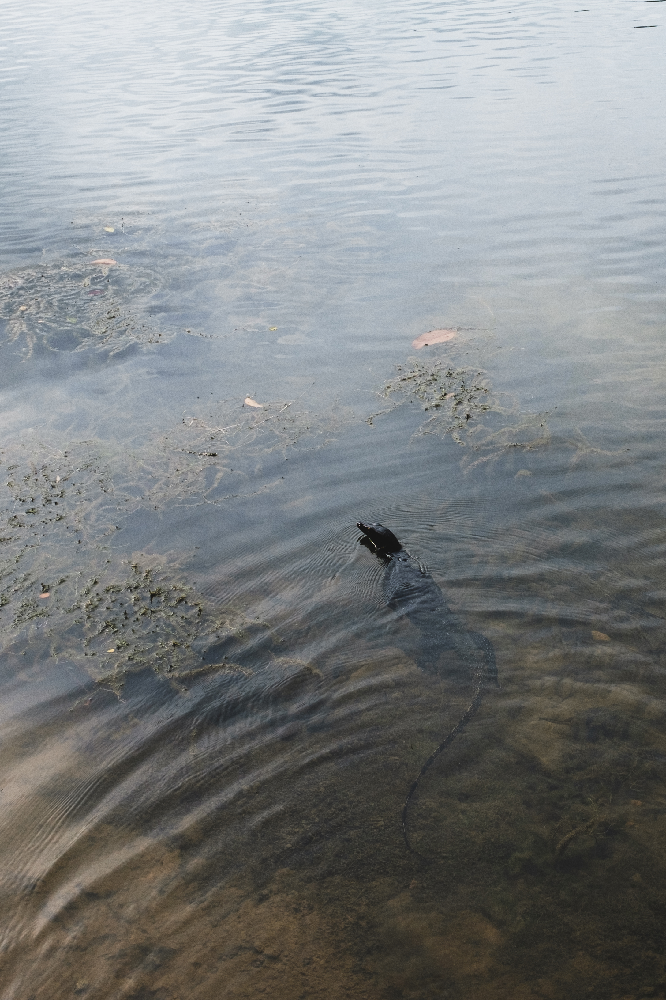
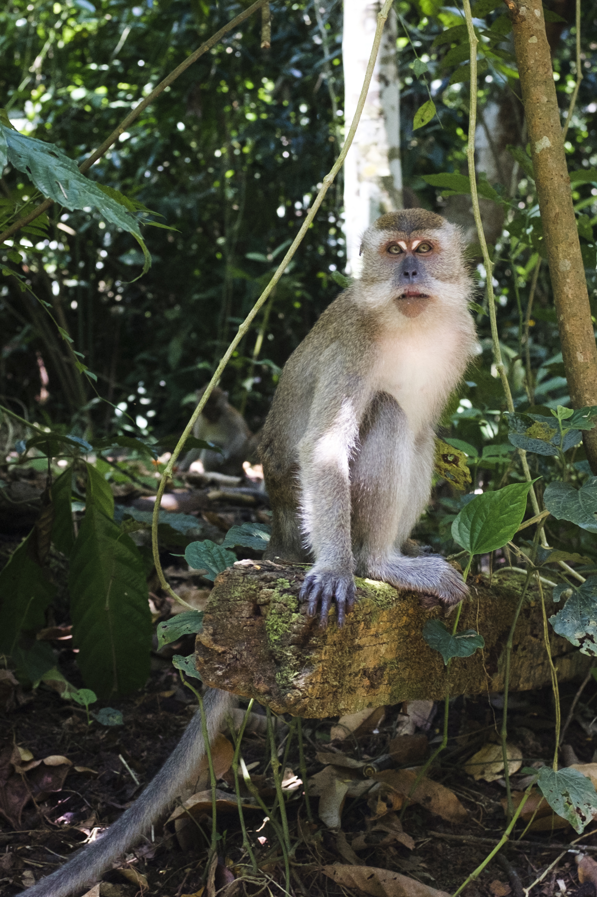

# Gemma Captioner Evaluation

Date: 2026-04-03

## Goal

Evaluate whether Gemma 4 is a better local captioning backend than Janus-Pro-1B for the photo indexer on an RTX 3080 10 GB machine.

The comparison focused on:

- quality of `identified_objects`, `themes`, `alt_text`, and `subject`
- local inference speed
- practicality on a 10 GB GPU
- integration risk

## Summary Table

| Model / path | Quality on 5-image sample | Predict time on `DSCF0506-2.jpg` | GPU practicality on 3080 10 GB | Integration status | Recommendation |
| --- | --- | --- | --- | --- | --- |
| `deepseek-ai/Janus-Pro-1B` | Good, conservative, won `1/5` vs full Gemma | about `2.8s` | Good | Already integrated | Keep as current default |
| `google/gemma-4-E2B-it` full precision via `transformers` | Best overall, won `4/5` vs Janus | about `15.5s` | Works, but slow | Working in repo | Use when quality matters more than speed |
| `google/gemma-4-E2B-it` 4-bit via `bitsandbytes` | Unusable, produced gray-image failures | Not meaningful | Fits badly and captions wrongly | Rejected | Do not use |
| `unsloth/gemma-4-E4B-it-GGUF:Q8_0` via `llama.cpp` | Good on landscapes, weaker on fine detail / animals, below full Gemma overall | about `9.9s` to `10.4s` with schema-constrained JSON | Works on 3080, uses most VRAM | Working experimental backend in repo | Best fast Gemma option so far |

Quick read:

- best quality: full `google/gemma-4-E2B-it`
- best practical production choice today: `Janus-Pro-1B`
- best optimisation target: `unsloth/gemma-4-E4B-it-GGUF:Q8_0` via `llama.cpp`
- video roadmap: promising for Gemma, but currently frame-based and not yet integrated into the repo

## Models Tested

1. `deepseek-ai/Janus-Pro-1B`
2. `google/gemma-4-E2B-it` full precision via `transformers`
3. `google/gemma-4-E2B-it` 4-bit via `bitsandbytes`
4. `unsloth/gemma-4-E4B-it-GGUF:Q8_0` via `llama.cpp`

## Headline Result

The best current quality model is full `google/gemma-4-E2B-it`.

The best current speed/reliability model is `Janus-Pro-1B`.

The most promising quantised Gemma path is `unsloth/gemma-4-E4B-it-GGUF:Q8_0` via `llama.cpp`.

With JSON-schema-constrained generation, it now returns clean JSON in the repo and no longer needs manual thought-channel cleanup for still-image captioning.

## Quality Comparison

### Sample set

The main qualitative comparison used the 5 JPEGs in `albums/test-simple/`.

### Janus vs full Gemma E2B

Visual judgement on the 5-image JPEG sample:

- `DSCF0506-2.jpg`: full Gemma better
- `DSCF0593.jpg`: full Gemma slightly better
- `DSCF2485-2.jpg`: Janus better
- `DSCF2581-2_2.jpg`: full Gemma slightly better
- `DSCF2768.JPG`: full Gemma better

Summary:

- full Gemma won `4/5`
- Janus won `1/5`

Observed pattern:

- full Gemma was usually more specific and more search-useful
- Janus was faster and more conservative
- when full Gemma missed, it could make a clean but wrong guess

Important miss:

- on `DSCF2485-2.jpg`, Janus identified a duck-like animal in water, while full Gemma guessed `fish`

### Quantised Gemma E4B Q8_0

After switching the `llama.cpp` path to JSON-schema-constrained generation, the quantised backend returned clean JSON reliably on the 5-image sample.

Observed quality on the same JPEGs:

- `DSCF0506-2.jpg`: good, comparable to full Gemma
- `DSCF0593.jpg`: good, comparable to full Gemma
- `DSCF2485-2.jpg`: weak, described water/reflection and missed the animal
- `DSCF2581-2_2.jpg`: acceptable, but `baboon` is less accurate than the stronger monkey/langur-style captions
- `DSCF2768.JPG`: weak, described the leaf but missed the insect

So the quantised quality verdict is:

- clearly better than the broken Transformers 4-bit path
- good enough to be interesting for bulk indexing
- still below full `google/gemma-4-E2B-it` on the checked-in sample
- probably closer to Janus than to full Gemma on quality

### Sample review

The following examples are the most useful part of the evaluation. They show the checked-in sample images and the actual captions from Janus, full Gemma, and quantised Gemma.

#### `DSCF0506-2.jpg`

| Model | Output | Quick judgement |
| --- | --- | --- |
| Janus | `A scenic mountain path surrounded by snow-covered peaks under a clear blue sky.` | Good, but broad. |
| Full Gemma E2B | `A paved road winds through a mountainous landscape with snow-capped peaks under a blue sky.` | Best. More literal and search-useful. |
| GGUF Gemma E4B Q8_0 | `A desolate dirt road winds through a mountainous landscape under a clear blue sky.` | Strong. Slightly less detailed than full Gemma. |

Verdict: full Gemma best, GGUF close behind, Janus still solid.

#### `DSCF0593.jpg`

| Model | Output | Quick judgement |
| --- | --- | --- |
| Janus | `A dam in a forested mountain area with a bridge crossing it.` | Good. |
| Full Gemma E2B | `A large concrete dam spans a body of water, set against a backdrop of forested mountains.` | Best. Slightly more specific and cleaner. |
| GGUF Gemma E4B Q8_0 | `A large dam built into steep, forested mountainsides near Ōmachi, Japan.` | Strong. Slightly more interpretive, but useful. |

Verdict: full Gemma and GGUF both good here; Janus is acceptable but plainer.

#### `DSCF2485-2.jpg`

| Model | Output | Quick judgement |
| --- | --- | --- |
| Janus | `A small duck swimming in a calm body of water with ripples around it.` | Best of the three, even if cautious. |
| Full Gemma E2B | `A fish swimming in shallow, clear water with ripples on the surface.` | Wrong animal. |
| GGUF Gemma E4B Q8_0 | `Calm surface of water reflecting the sky near Hillcrest Park, Singapore.` | Missed the subject entirely. |

Verdict: Janus clearly best. This is a good reminder that Gemma can fail on subtle wildlife subjects.

#### `DSCF2581-2_2.jpg`

| Model | Output | Quick judgement |
| --- | --- | --- |
| Janus | `A monkey sitting on a tree branch surrounded by lush green leaves.` | Good and safe. |
| Full Gemma E2B | `A monkey is perched on a mossy tree branch in a dense, green forest.` | Best. Richer detail without drifting. |
| GGUF Gemma E4B Q8_0 | `A wild baboon sits on a tree branch in a forested area.` | Acceptable scene read, but species guess is less accurate. |

Verdict: full Gemma best, Janus close, GGUF a little too confident.

#### `DSCF2768.JPG`

| Model | Output | Quick judgement |
| --- | --- | --- |
| Janus | `leaves with a small insect on one of them` | Best. It catches the insect. |
| Full Gemma E2B | `A small insect is resting on a bright green leaf of a variegated plant.` | Also strong. Very usable. |
| GGUF Gemma E4B Q8_0 | `Close-up of a green and white variegated plant leaf.` | Weakest. Missed the insect. |

Verdict: full Gemma and Janus are both good; GGUF loses fine-detail recall here.

## Performance Comparison

All timings below were measured locally on the RTX 3080 10 GB machine.

### Janus-Pro-1B

Measured on `albums/test-simple/DSCF0506-2.jpg`:

- init: about `7.0s`
- predict: about `2.8s`

### Full Gemma E2B

Measured on the same image:

- init: about `15.8s`
- predict: about `15.5s`

Relative to Janus:

- init about `2.2x` slower
- predict about `5.6x` slower

### Gemma E2B 4-bit in Transformers

This path is not usable.

It repeatedly described real photos as gray placeholder-like images. That failure reproduced even with official Google weights when loaded with `bitsandbytes` 4-bit quantisation.

Verdict:

- reject this path

### Quantised Gemma E4B Q8_0 in llama.cpp

Working path:

- CUDA `llama.cpp`
- `unsloth/gemma-4-E4B-it-GGUF:Q8_0`
- `mmproj-BF16`
- low image token budget for captioning: `70-140`

Representative measurements with the repo-integrated backend and schema-constrained JSON:

- mountain image benchmark:
  - init about `0.05s`
  - predict about `10.36s`
- 5-image `test-simple` comparison run:
  - median per image about `9.90s`
  - parse success `5/5`

Observed pattern:

- the GGUF path is materially faster than full Gemma E2B
- it is still much slower than Janus-Pro-1B
- lower image token budgets (`70-140`) remain the right setting for captioning
- JSON schema guidance fixes the earlier thought-channel problem for still-image outputs

## Hardware / Runtime Findings

### Full Gemma E2B

- works in the existing Python stack
- quality is good
- slow for bulk indexing

### Gemma 4-bit in Transformers

- broken for vision in this environment
- not recommended

### Gemma E4B Q8_0 in llama.cpp

- fits on the 10 GB 3080 with automatic layer fitting
- uses most of the card
- works with `--jinja`
- works better for captioning with lower image token budgets

### Low-impact CPU-offload mode

Added for full Gemma in the Python stack.

Measured on one image:

- `1.5 GiB` GPU headroom: predict about `101.0s`
- `2.0 GiB` GPU headroom: predict about `112.6s`
- `3.0 GiB` GPU headroom: predict about `135.5s`

Verdict:

- useful only if the machine must stay responsive
- too slow for large-scale indexing

## Video

Gemma 4 supports video conceptually by processing frames, and E2B/E4B also support audio.

For this repo, video is not yet integrated into the current captioning/indexing path. The checked-in `DSCF0159.MOV` in `albums/test-simple/` was not included in the main caption bake-off because the current pipeline only handles still-image inputs.

### Video roadmap check

The checked-in `DSCF0159.MOV` is a `13.0s` 4K clip with audio. Sampled frames show a very dark scene with defocused blue, purple, and red light blobs, so it is a useful hallucination stress test rather than an easy semantic clip.

What worked locally:

- full Gemma can in principle accept multiple sampled frames as one prompt, which matches the official Gemma video-as-frames approach
- the `llama.cpp` `E4B Q8_0` path also accepted multiple sampled frames from the same clip
- in the `llama.cpp` run, the model's reasoning trace correctly identified a dark scene with coloured circular lights and started comparing frame-to-frame changes

What did not work yet:

- there is no direct video input path in the repo today
- the current `llama.cpp` multimodal CLI does not take a video file directly; the working pattern is to sample frames and pass them as multiple images
- the still-image schema fix has not yet been generalised into a proper video-caption wrapper
- audio support was not exercised in the local tests

Practical implication:

- Gemma video support looks real enough to keep on the roadmap
- the first repo implementation should treat video captioning as sampled-frame captioning
- audio should be considered a later phase unless it becomes important for search

## Recommendation

### Near-term production recommendation

Keep `Janus-Pro-1B` as the default production captioner for now.

Reason:

- much faster
- already integrated
- acceptable quality
- no extra runtime stack required

### Best quality recommendation

If quality is the only priority, use full `google/gemma-4-E2B-it`.

Reason:

- best judged quality on the checked-in JPEG sample
- better specificity than Janus in most cases

Trade-off:

- much slower than Janus

### Best quantised experiment recommendation

The best quantised Gemma option tested so far is:

- `unsloth/gemma-4-E4B-it-GGUF:Q8_0` via `llama.cpp`

Reason:

- this is the first quantised Gemma path that worked well locally and returned clean JSON in the repo
- it is much more promising than the broken Transformers 4-bit path
- Unsloth explicitly recommends `Q8_0` for `E2B` / `E4B`

Trade-off:

- faster than full Gemma
- slower than Janus
- quality appears mid-way between Janus and full Gemma on the current sample

### What should happen next

Do not spend more time on Transformers `bnb-4bit`.

Instead:

1. keep the new `llama.cpp` backend for Gemma E4B Q8_0
2. if this becomes the preferred path, stop spawning a fresh process per image and move to a warm long-lived worker or server
3. rerun a larger sample from the real library, not just `test-simple`
4. evaluate whether the speed win over full Gemma is worth the quality drop on subtle subjects
5. if yes, use quantised E4B for bulk indexing and keep Janus as rollback

## Final Call

Current ranking:

1. full `google/gemma-4-E2B-it` for quality
2. `Janus-Pro-1B` for practical production use
3. `unsloth/gemma-4-E4B-it-GGUF:Q8_0` as the best fast Gemma option so far, but still not clearly better than Janus overall on the current sample
